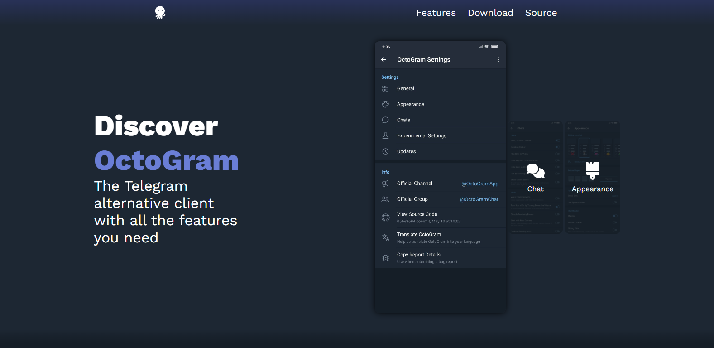
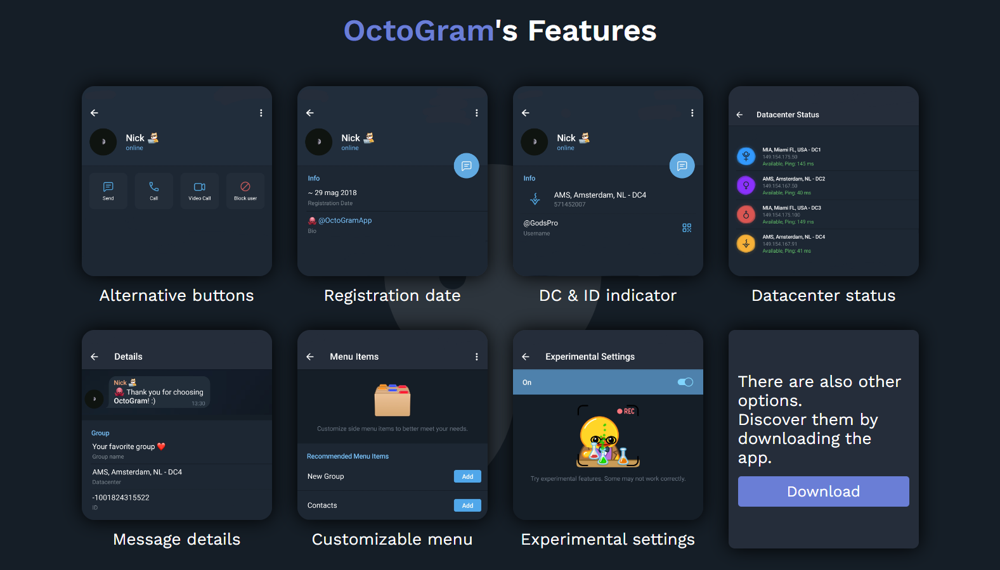

# 🐙 OctoGram Website
OctoGram is an **unofficial** messaging app that uses **Telegram's API**. This site reflects all the features of the Telegram client.

# 🔗 Website links
* [Main website](https://octogram.site/)
* [Main website (features)](https://octogram.site/#features)
* [Main website (download)](https://octogram.site/#download)

# 🖼️ Screenshots

Check our website for other informations

# 💕 References
## 🟦 Colors
The colours of the site are all obtained through the client's default 'dark' theme. Other colour references can be found in the [octogram.config.css](https://github.com/OctoGramApp/Website/blob/main/assets/styles/octogram.config.css) file.
## ⬇️ Download links
* Universal APK: https://github.com/OctoGramApp/OctoGram/releases/download/%23stable/Universal.apk
* ARM64 APK: https://github.com/OctoGramApp/OctoGram/releases/download/%23stable/arm64.apk
* ARM32 APK: https://github.com/OctoGramApp/OctoGram/releases/download/%23stable/arm32.apk
* X86_64 APK: https://github.com/OctoGramApp/OctoGram/releases/download/%23stable/x86_64.apk
* X86 APK: https://github.com/OctoGramApp/OctoGram/releases/download/%23stable/x86.apk
## 🦋 Icons
* Settings icon: https://fontawesome.com/icons/gear?f=classic&s=solid
* Chat icon: https://fontawesome.com/icons/comments?f=classic&s=solid
* Appearance icon: https://fontawesome.com/icons/brush?f=classic&s=solid